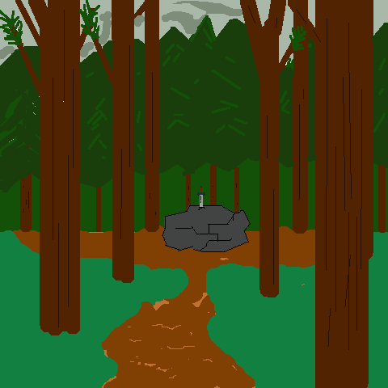
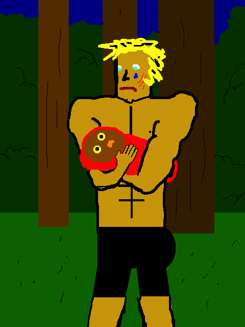
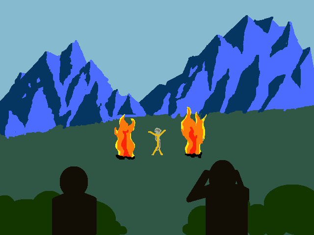

# Welcome, traveler

Here can be found the stories of daring heroes, cunning thieves, and bold adventure that all hearts seek. Let your mind run free in distant lands (cause god knows here kinda sucks).

[Back to the Castle](https://whcampbell.github.io/Ivys-Castle/)

## The Curse of Strahd

In the fog-shrouded lands of Barovia, four strangers awake to lands unkown with no recollection of their arrival...

_Slim Darkness_ is the type of man to steal the pennies off your eyes. He's not dumb enough to stick his neck out for whomever he's 
walking with for that moment. He wakes up in the forest to the sight of a strange old man. _Sir Lysander Stanley Conrad_, a big-game hunter
who found himself in Barovia long ago, was happy to greet a new arrival. 

"Nice to meet you good sir!" Lysander had barely pulled Slim to the ground before beginning to vehemently shake his hand. "My name is Sir
Lysander Stanley Conrad!" Slim, somewhat confused at the situation in which he found himself, replied "I'm Slim, Slim Darkness. Do you mind
telling me where I am?" Lysander was still shaking Slim's hand vigorously when he answered "You're in Barovia good sir, a foggy
land of mystery and evil."

"Excellent." Slim was not a believer in evil and didn't buy into mystery, but he paused for a moment to reckon uopn his next move. He then 
realized that Lysander was still shaking his hand fervently and extracted it from his grasp. "Is there any way back to the mainland?" Slim asked. 

"Well, that's somewhat complicated. Walk with me back to my home and I'll fill you in on some of the details." Slim nodded, and they moved along.
After striding through the damp pine forest for a few silent moments, Slim glimpsed an odd sight through the trees. There, in a clear circle about 
twenty feet across, lay a large boulder, and sticking out from it was a gleaming sword. Lysander was somewhat taken aback, because in his many 
forays into these woods he had never seen this sword and stone. Slim looked to Lysander for information, but upon seeing that he was just as
confused, he walked forth and climbed onto the stone. Slim was armed well enough, but he was always open to collect goods for trade. There was also
a strange feeling he had, as if the sword had called to him. 

Lysander watched as Slim placed his feet firmly under him and focused his energy. Slim rubbed his hands together and slowly laid them upon the 
leather-bound hilt of the sword. Lysander saw his muscles beginning to tense, saw the sword begin to give. All at once, with a great effort, Slim 
snapped the hilt right off.

"Damn!" Slim exclaimed. 
"That was rather anticlimactic my boy. May we go on? My game is starting to smell," Lysander urged. Slim looked down at the sword, knowing that 
there was no way to get it out. Not that it was worth anything in two pieces anyways. He could not shake that strange feeling, though, so he placed
the hilt into his bag before dismounting the rock and walking along with Lysander. 

An intereting sight awaited them when they reached Lysander's town. They had just gotten past the outlying cottages when they saw a half-naked man
locked in the town stockades. 

...

Chadman looked deep into its eyes as the creature took its last breaths. There was a moment of silence as a breeze fluttered through the leaves 
of the forest. Under the rustling of the leaves a softer sound could be heard... _Hoo... hooo..._ as if a child were calling for mother. 
Chadman, distraught by this crime against such a beautiful thread in the great tapestry of nature, knew that something had to be done. Diving
through the brush, he soon found the source of the sound, a young owl-bear now bereft of its mother. Chadman's heart was breaking, so he took
up the young one and wrapped it in a blanket while it nipped softly at his fingers. The other party members looked amongst each other. They knew 
that taking care of an animal, a wild one at that, could keep them from their duty of confronting Strahd. Lysander let a deep sigh escape him, 
and walked towards Chadman.

"Son, I know that you don't approve of what we've done here. But that child is safest on its own. Owl-bears are an apex preadator, and even
a child can easily fend for itself. What you need to do, in order to help the order of nature, is to let him go."

Chadman looked back at Lysander, then down again to the young one swaddled in his arms. A warm tear trickled from his eye, and he began to unwrap
the child. As he was putting it down, he said, "I'll never forget you. Stay safe out there Brad." The owl-bear took a few steps, looked back once
again, and then dashed deep into the woods. 

So the adventurers continued their quest to the Mad Mage.

...

The adventurers began to hear thunderous noises as the trees around them began to thin. Suddenly they came upon a large clearing in which an old,
naked man was prancing about. Lysander pegged him immediately as the man that Bluto had mentioned. The noises still confused them, until at once
the old man made a powerful gesture to the sky and summoned great columns of fire from the earth. 

